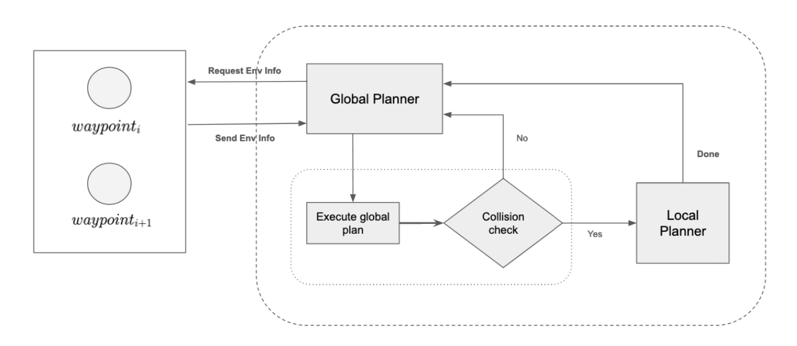
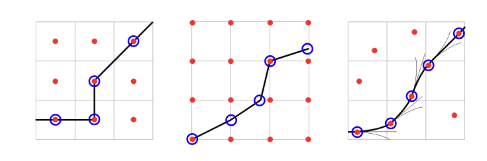

# Introduction

## Objective

* The objective of this project is create motion planning simulation for a car using Webots simulator.
* A sample hybrid planner, which consists a global and local planner, is implemented to drive the vehicle autonomously in the pre-existing environment.
* This project does not make attempts on mapping the environemnt and the focus is purely on motion planning
* More details about the architecture can be found here 

## Simulation

* [Webots](https://cyberbotics.com/) is an open source simulation service
* This project created a new **controller** for webots [city world](https://cyberbotics.com/doc/automobile/city) simulation.

## Architecture

The architecture consists of two planners, a global and local planner.

* The global planner consists of logic to help the vehicle navigate a road segment, in a manner such that no obstacles are present.

* When an obstacle is pressent, the planner switches to the local planner, which executed a motion planning algorithm to figure out a path avoiding the obstacle.

### Hybrid A* Algorithm

* This is a variant of the $A^*$ algorithm applied to the 3D kinematics state space of the vehicle, with modified state-update rule that captures continuous-state data in the discrete searcg nodes of $A^*$.

* Hybrid-state $A^*$ is not guaranteed to find the minimal-cost solution, due to its merging of continuous-coordinate states that occupy the same cell in the discretized space, however we will get a path through which the vehicle can commute.

 

  

  
<em>Figure: Graphical comparison of search algorithms.</em>

  
<em>Left: A* associates costs with centers of cells and only visits states that correspond to grid-cell centers. 
  Center: <a href="https://www.semanticscholar.org/paper/The-Field-D-*-Algorithm-for-Improved-Path-Planning-Ferguson-Stentz/58f3bc8c12ee8df30b3e9564fdd071e729408653">Field D*</a> and <a href="https://arxiv.org/abs/1401.3843">Theta*</a> associate costs with cell corners and allow arbitrary linear paths from cell to cell. 
  Right: <a href="https://www.semanticscholar.org/paper/Practical-Search-Techniques-in-Path-Planning-for-Dolgov/62a7cf939e24bf542958489ea75bb7551f16e43f">Hybrid A*</a> associates a continuous state with each cell whose score is the cost of its associated continuous state.</em>

 

* The algorithm provides provisions to penalise motions that switch directions

* The heuristics used ignores obstacles and takes into account the non-holonomic nature of the car, by considering the distance between $(x_t, y_t, \theta_t)$ and $(x_g, y_g, \theta_g)$

* We used the Euclidean distance between the current state and the goal state to find the heuristics. A small penalty was also introduced to the angular distance and $\beta=0.5$:

$$
\sqrt{(x - x_{\text{goal}})^2 + (y - y_{\text{goal}})^2 + \beta(\theta - \theta_{\text{goal}})^2}
$$

* Here the kinematic bicycle model (<a href="https://ieeexplore.ieee.org/document/7995816">ref</a>) to update the state space of the vehicle, for each iteration of the algorithm, where $\delta$ is the change in steering angle

$$
\begin{aligned}
    \dot{x} &= x + v \cdot \cos(\theta) \cdot dt \\
    \dot{y} &= y + v \cdot \sin(\theta) \cdot dt \\
    \dot{\theta} &= \theta + \left( \frac{v \cdot \tan(\delta)}{L} \right) \cdot dt
\end{aligned}
$$

